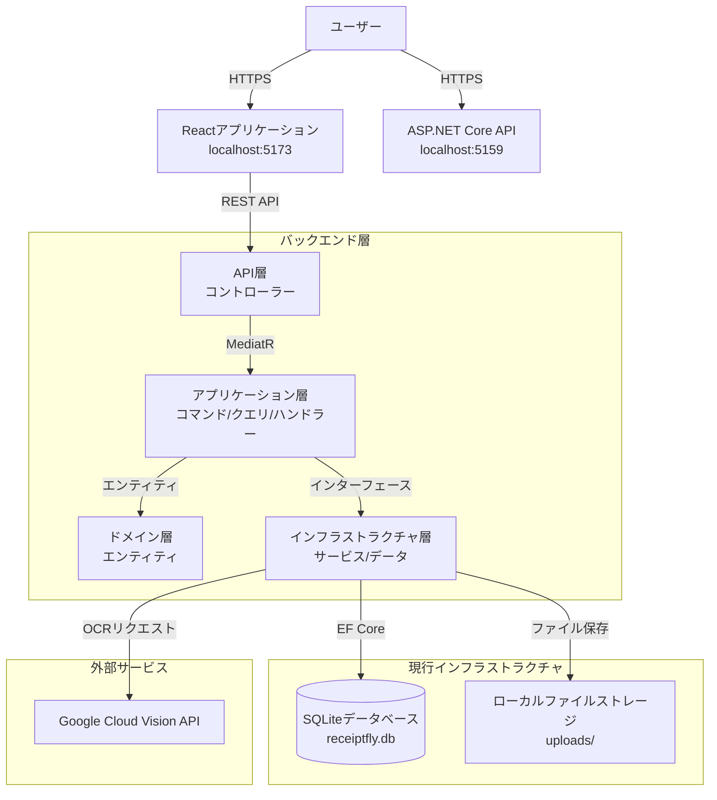
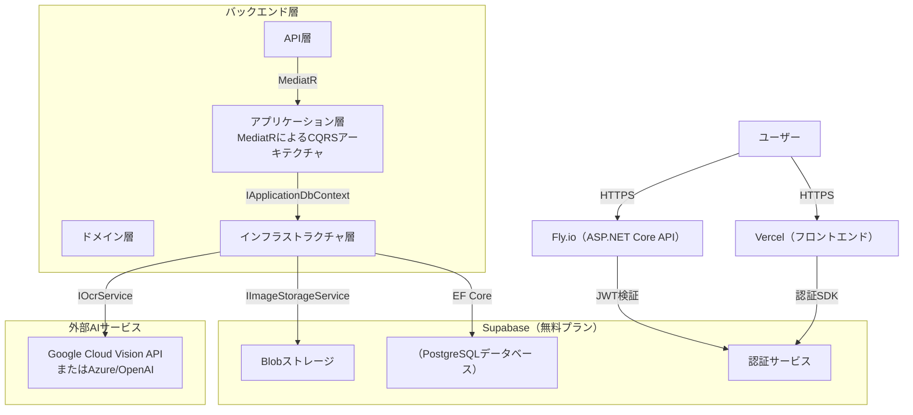

# アーキテクチャ＆技術スタック（低コスト/インディー向けスタック）

## 設計思想

**「固定費ゼロ」**：無料利用枠が充実したサービスを優先し、アプリがスケールするまで運用コストを 0 円に抑える。
**モダンかつシンプル**：「難しい部分」（認証、DB、ストレージなど）はマネージドサービスを活用し、アプリロジックの開発に集中する。
**修正可能性を最優先**：ビジネスロジックを書き直すことなくインフラ変更が可能な、高い修正可能性を備えたアーキテクチャ設計。

## 現状とロードマップ（2025 年 11 月時点）

### 現在の実装状況

- **アーキテクチャパターン**：クリーンアーキテクチャを採用し、関心事の明確な分離を実現（ドメイン層、アプリケーション層、インフラストラクチャ層、API 層の 4 層構成）
- **CQRS パターン**：MediatR ベースの CQRS 実装により、コマンド処理とクエリ処理を明確に分離
- **OCR 処理フロー**：バックエンドでは Google Cloud Vision API と連携し、領収書画像（PDF 形式および画像形式両方に対応）を解析
- **データ処理**：解析結果を処理し、合計金額や明細項目などの構造化領収書データを生成
- **データベース**：現在は開発用に SQLite を使用（EF Core 経由で PostgreSQL 対応を準備中）
- **ストレージ**：現在はローカルファイルストレージを使用（`IImageStorageService`インターフェースで抽象化されており、将来的にクラウドストレージへの移行が可能）
- **API**：Swagger ドキュメント対応の RESTful API を実装

### アーキテクチャ上の検討事項と未決定事項

現在、コストとパフォーマンスのバランスを考慮した最適なインフラストラクチャ構成を検討中です。

- **インフラストラクチャ（Supabase vs. VPS）**：
  - 当初計画：運用負荷軽減のためデータベースと認証機能に Supabase を採用
  - 現在検討中：ユーザー数増加に伴う長期的なコスト削減を見据え、VPS（仮想専用サーバー）への移行を検討中
  - 現在の状況：開発時は SQLite を使用、EF Core による PostgreSQL 対応用マイグレーションは準備完了
- **認証機能**：
  - Supabase から他の認証方式へ移行する場合、認証戦略（自己ホスト型認証、Auth0 の利用、または Supabase 認証をデカップリングした方式の継続）を再検討する必要あり
  - 現在の状況：認証機能は未実装（今後のフェーズで計画中）
- **ストレージ**：
  - 現在の状況：ローカルファイルストレージ（`LocalFileStorageService`）を使用、インターフェースで抽象化済み
  - 将来的な移行：`IImageStorageService`インターフェースを実装することで、Supabase Storage や他のクラウドストレージへ容易に切り替え可能

### 必須要件：変更容易性（モジュラー性）

> **重要**：インフラストラクチャ構成（VPS vs. Supabase）および認証機能に関する未決定事項があるため、システムアーキテクチャは**高い変更容易性**を設計上の必須要件とする。

- **疎結合設計**：アプリケーションロジックを特定のインフラストラクチャ実装から分離するため、以下の手法を採用：
  - **クリーンアーキテクチャ**：明確なレイヤー境界の定義（ドメイン層 → アプリケーション層 → インフラストラクチャ層 → API 層）
  - **依存関係逆転の原則**：アプリケーション層が抽象インターフェースに依存する設計（`IApplicationDbContext`、`IOcrService`、`IImageStorageService`など）
- **抽象化レイヤー**：以下の機能領域でインターフェースと抽象化レイヤーを活用：
  - **永続化層**：`IApplicationDbContext`インターフェースにより、EF Core を介して SQLite、PostgreSQL その他のデータベースへの切り替えが可能
  - **認証機能**：未実装だが、追加時には抽象化レイヤーとして設計予定
  - **OCR サービス**：`IOcrService`インターフェースにより、プロバイダーの切り替えが可能（現在は Google Vision を使用、将来的には Azure、OpenAI、AWS などへの変更が可能）
  - **ストレージ**：`IImageStorageService`インターフェースにより、ローカルストレージ、Supabase Storage、その他のクラウドストレージへの切り替えが可能

## 技術スタック

### フロントエンド

- **フレームワーク**：React 19（シングルページアプリケーション）
- **ビルドツール**：Vite 7
- **プログラミング言語**：TypeScript 5.9
- **ルーティング**：React Router DOM 7
- **UI コンポーネント**：Lucide React（アイコンライブラリ）
- **状態管理**：React Context API
- **Supabase クライアント**：`@supabase/supabase-js`（将来的な認証/ストレージ統合を見据えて準備済み）
- **ホスティング**：**Vercel**または**Cloudflare Pages**（無料プラン利用可能、高パフォーマンス）

### バックエンド

- **フレームワーク**：ASP.NET Core Web API（C#）
- **ランタイム環境**：.NET 8
- **アーキテクチャパターン**：クリーンアーキテクチャ（ドメイン層、アプリケーション層、インフラストラクチャ層、API 層の分離）
- **CQRS パターン**：コマンド/クエリ分離のために MediatR 12.4.1 を採用
- **バリデーション**：FluentValidation 11.11.0
- **ORM**：Entity Framework Core 8.0
- **API ドキュメント**：Swagger/OpenAPI
- **デプロイメント**：Docker コンテナ（計画段階）
- **ホスティング**：**Fly.io**（小規模 VM 向け無料枠あり）または**Render**（無料プラン利用可能、アイドル時は自動停止）
  - _選定理由_：C#ではコンテナランタイムが必須となる。これらのプラットフォームは、無料プランでコンテナの「git push によるデプロイ」体験を最も容易に提供する。

### インフラストラクチャ（現行環境 vs. 計画環境）

#### 現行実装環境

- **データベース**：**SQLite**（開発環境用）
  - _統合方法_：Entity Framework Core と SQLite プロバイダーを使用
  - _マイグレーション管理_：インフラストラクチャ層で EF Core のマイグレーションを設定済み
  - _PostgreSQL 対応_：Npgsql.EntityFrameworkCore.PostgreSQL パッケージを組み込み済みで、マイグレーション準備完了
- **ストレージ**：**ローカルファイルストレージ**
  - _実装方法_：インフラストラクチャ層の`LocalFileStorageService`を使用
  - _抽象化レイヤー_：アプリケーション層の`IImageStorageService`インターフェースで抽象化
  - _保存場所_：API プロジェクトのルートディレクトリにある`uploads/`フォルダ

#### 計画中のインフラストラクチャ環境（BaaS - Backend as a Service）

コアインフラストラクチャソリューションとして**Supabase**の採用を推奨します。無料プランでは 500MB のデータベース容量、50,000MAU までの認証機能、1GB のストレージ容量が利用可能です。

- **データベース**：**Supabase（PostgreSQL ベース）**
  - _統合方法_：Entity Framework Core（Npgsql 経由）で接続可能 - 必要なパッケージは既に組み込み済み
  - _マイグレーション手順_：接続文字列を変更し、マイグレーションを実行するだけで移行可能
- **認証**：**Supabase Auth**
  - _統合方法_：React 向けの使いやすい SDK を提供（フロントエンドにはすでに`@supabase/supabase-js`パッケージを組み込み済み）。C#側で JWT 認証を検証可能
  - _実装状況_：現在未実装
- **ストレージ**：**Supabase Storage**（領収書画像用）
  - _マイグレーション手順_：Supabase Storage クライアントを実装し、`IImageStorageService`インターフェースに対応する機能を追加

### AI / OCR 処理（領収書処理関連）

- **現行実装**：**Google Cloud Vision API**を使用
  - _パッケージ_：`Google.Cloud.Vision.V1` 3.7.0
  - _認証方法_：API キーまたはサービスアカウント JSON ファイルで認証可能（環境変数または appsettings ファイルで設定変更可能）
  - _モックテスト対応_：テスト用の`MockGoogleVisionOcrService`を用意済み（`UseMockOcr`設定で有効化可能）
  - _対応ファイル形式_：画像ファイル（JPG、PNG、GIF、BMP）と PDF 形式をサポート
- **抽象化レイヤー**：`IOcrService`インターフェースを実装することで、プロバイダーの切り替えが可能
- **代替オプション**（インターフェース経由で実装可能）：
  - **Azure AI Document Intelligence**（無料プラン：月間 500 ページまで）
    - _選定理由_：領収書処理に特化しており、非常に高い認識精度を実現。無料プランでも個人利用や開発用途には十分な性能
    - **OpenAI API（GPT-4o）**
      - _選定理由_：従量課金制。処理量が非常に少ない場合にはコスト効率が良いが、領収書処理に関しては構造化されたデータ処理に優れた Azure Doc Intelligence がより適している

## アーキテクチャ図

### 現行実装構成



### 計画中のアーキテクチャ（Supabase への移行案）



## プロジェクト構成

### バックエンド（クリーンアーキテクチャ）

```
backend/
├── Receiptfly.Api/              # API層（コントローラ、Program.cs）
│   ├── Controllers/
│   │   ├── OcrController.cs
│   │   └── ReceiptsController.cs
│   └── Program.cs              # DIコンテナ、ミドルウェア設定
│
├── Receiptfly.Application/      # アプリケーション層（ビジネスロジック）
│   ├── Commands/               # CQRSコマンド
│   │   ├── CreateReceipt/
│   │   ├── UpdateReceipt/
│   │   └── UpdateTransactionItem/
│   ├── Queries/                 # CQRSクエリ
│   │   ├── GetReceipts/
│   │   └── GetReceiptById/
│   ├── Interfaces/              # アプリケーション抽象インターフェース
│   │   └── IApplicationDbContext.cs
│   └── Services/                # サービスインターフェース
│       ├── IOcrService.cs
│       └── IImageStorageService.cs
│
├── Receiptfly.Domain/           # ドメイン層（エンティティ）
│   └── Entities/
│       ├── Receipt.cs
│       └── TransactionItem.cs
│
└── Receiptfly.Infrastructure/   # インフラストラクチャ層（外部依存関係）
    ├── Data/
    │   ├── ApplicationDbContext.cs
    │   └── DesignTimeDbContextFactory.cs
    ├── Migrations/               # EF Coreマイグレーション
    └── Services/                 # サービス実装
        ├── GoogleVisionOcrService.cs
        ├── MockGoogleVisionOcrService.cs
        └── LocalFileStorageService.cs
```

### フロントエンド

```
frontend/receiptfly-web/
├── src/
│   ├── components/             # Reactコンポーネント
│   │   └── Layout/
│   ├── pages/                  # ページコンポーネント
│   │   ├── Dashboard/
│   │   ├── Scan/
│   │   ├── ReceiptDetail/
│   │   ├── ManualEntry/
│   │   ├── Analytics/
│   │   └── Settings/
│   ├── context/                # Reactコンテキスト
│   │   ├── ReceiptContext.tsx
│   │   └── SettingsContext.tsx
│   ├── types/                  # TypeScript型定義
│   └── data/                   # モックデータ
```

## 主要な設計パターン

### 1. クリーンアーキテクチャ

- **ドメイン層**: 純粋なビジネスエンティティのみで構成され、外部依存なし
- **アプリケーション層**: ビジネスロジックを処理し、ドメイン層にのみ依存
- **インフラストラクチャ層**: 外部依存関係（DB、API、ストレージなど）を担当し、アプリケーション層のインターフェースを実装
- **API 層**: コントローラーで構成され、アプリケーション層に依存

### 2. CQRS（コマンドクエリ責務分離）

- **コマンド**: `CreateReceiptCommand`, `UpdateReceiptCommand`, `UpdateTransactionItemCommand`
- **クエリ**: `GetReceiptsQuery`, `GetReceiptByIdQuery`
- **MediatR**: コマンド/クエリのルーティングと実行処理を担当
- **メリット**: 明確な役割分担による可読性向上、テスト容易性の向上、拡張性の高いアーキテクチャ設計

が可能

### 3. 依存関係逆転の原則

- アプリケーション層がインターフェースを定義（`IApplicationDbContext`, `IOcrService`, `IImageStorageService`など）
- インフラストラクチャ層がこれらのインターフェースを実装
- ビジネスロジックを変更することなく、実装部分を柔軟に差し替え可能

### 4. リポジトリパターン（IApplicationDbContext 経由）

- `IApplicationDbContext`がデータアクセスを抽象化
- 現在の実装例: EF Core の`ApplicationDbContext`
- 異なるデータアクセス戦略に変更することも可能

## データフローの具体例

### 領収書作成フロー

1. フロントエンドから`/api/receipts`への POST リクエストで領収書データを送信
2. `ReceiptsController`がリクエストを受信
3. Controller が`CreateReceiptCommand`オブジェクトを生成し、MediatR 経由で送信
4. `CreateReceiptCommandHandler`（アプリケーション層）がビジネスロジックを処理
5. ハンドラが`IApplicationDbContext`を使用してデータベースに保存
6. インフラストラクチャ層（`ApplicationDbContext`）が SQLite データベースに永続化
7. フロントエンドにレスポンスを返却

### OCR 処理フロー

1. フロントエンドから`/api/ocr`への POST リクエストで画像ファイルを送信
2. `OcrController`がファイルデータを受信
3. Controller が`IImageStorageService`を使用してファイルを保存（インフラストラクチャ層: `LocalFileStorageService`）
4. Controller が`IOcrService`を使用してテキスト抽出を実行（インフラストラクチャ層: `GoogleVisionOcrService`）
5. Google Cloud Vision API が画像を処理
6. OCR 処理結果をフロントエンドに返却

## 月間コスト見積もり

### 現行実装（開発段階）

| サービス                       | ティア    | コスト | 備考                             |
| :----------------------------- | :-------- | :----- | :------------------------------- |
| **フロントエンド（ローカル）** | 開発      | **$0** | localhost 上で稼働中             |
| **バックエンド（ローカル）**   | 開発      | **$0** | localhost 上で稼働中             |
| **データベース（SQLite）**     | ローカル  | **$0** | ファイルベースのデータベース     |
| **ストレージ（ローカル）**     | ローカル  | **$0** | ローカルファイルシステム         |
| **OCR（Google Vision）**       | Free Tier | **$0** | 初回 1,000 リクエスト/月まで無料 |
| **合計**                       |           | **$0** | 開発環境                         |

### 予定される本番環境（Supabase 採用時）

| サービス                     | ティア    | コスト | 備考                                       |
| :--------------------------- | :-------- | :----- | :----------------------------------------- |
| **フロントエンド（Vercel）** | ホビー    | **$0** | 個人利用なら帯域制限なし                   |
| **バックエンド（Fly.io）**   | ホビー    | **$0** | 最大 3 台の小型 VM（共有 CPU）まで無料     |
| **データベース（Supabase）** | Free      | **$0** | 500MB のストレージ容量が含まれます         |
| **認証（Supabase）**         | Free      | **$0** | 1 ヶ月あたり 50,000 アクティブユーザーまで |
| **ストレージ（Supabase）**   | Free      | **$0** | 1GB のストレージ容量が含まれます           |
| **OCR（Google Vision）**     | Free Tier | **$0** | 初回 1,000 リクエスト/月まで無料           |
| **合計**                     |           | **$0** | _利用量に応じてスケールします_             |

### 代替 OCR オプション

| サービス                           | ティア     | コスト | 備考                         |
| :--------------------------------- | :--------- | :----- | :--------------------------- |
| **Google Cloud Vision**            | Free Tier  | **$0** | 初回 1,000 リクエスト/月まで |
| **Azure AI Document Intelligence** | Free Tier  | **$0** | 1 ヶ月あたり 500 ページまで  |
| **OpenAI GPT-4o**                  | 従量課金制 | 変動制 | 利用量に応じて変動します     |

## コスト比較：Supabase vs. VPS

### Supabase の料金体系

#### Free Tier（個人開発・小規模プロジェクト向け）

| リソース                     | 制限値             | 備考                        |
| :--------------------------- | :----------------- | :-------------------------- |
| **データベース**             | 500MB              | 小規模プロジェクトに最適    |
| **ストレージ**               | 1GB                | レシート画像の保存に使用    |
| **帯域幅（アウトバウンド）** | 5GB/月             | データ転送量                |
| **月間アクティブユーザー数** | 50,000 ユーザー    | 月間アクティブユーザー数    |
| **API リクエスト**           | 無制限             | リクエスト数に制限なし      |
| **プロジェクト数**           | 2 プロジェクト     | 最大 2 つのプロジェクトまで |
| **バックアップ**             | 毎日（7 日間保持） | 自動バックアップ            |
| **コスト**                   | **$0/月**          | 完全無料                    |

**制限事項:**

- 1 週間アクセスがない場合、プロジェクトが休止状態になる可能性があります
- 本番環境での使用には制限が適用される場合があります

#### Pro Tier（商用・中規模プロジェクト向け）

| リソース                     | 制限値             | 超過料金           |
| :--------------------------- | :----------------- | :----------------- |
| **データベース**             | 8GB                | $0.125/GB          |
| **ストレージ**               | 100GB              | $0.021/GB          |
| **帯域幅（アウトバウンド）** | 250GB/月           | $0.09/GB           |
| **月間アクティブユーザー数** | 100,000 ユーザー   | $0.00325/ユーザー  |
| **バックアップ**             | 毎日（7 日間保持） | -                  |
| **サポート**                 | メールサポート     | -                  |
| **コスト**                   | **$25/月**         | 超過分は従量課金制 |

### VPS 料金比較例

一般的な VPS プロバイダーの料金（小規模プロジェクト向け）:

| プロバイダー     | プラン       | CPU    | RAM | Storage | Bandwidth | 月額費用 | 備考                     |
| :--------------- | :----------- | :----- | :-- | :------ | :-------- | :------- | :----------------------- |
| **Vultr**        | レギュラー   | 1 vCPU | 1GB | 25GB    | 1TB       | $6/月    | シンプルで低価格         |
| **DigitalOcean** | ベーシック   | 1 vCPU | 1GB | 25GB    | 1TB       | $6/月    | 人気のプロバイダー       |
| **Linode**       | Nanode       | 1 vCPU | 1GB | 25GB    | 1TB       | $5/月    | 低価格                   |
| **ConoHa**       | スタンダード | 1 vCPU | 1GB | 50GB    | 無制限    | ¥500/月  | 日本国内、日本語サポート |

**VPS 利用時に追加で必要なコスト:**

- データベース管理: PostgreSQL を自身でセットアップ・管理（時間コスト）
- ストレージ: VPS のストレージ容量内で管理
- バックアップ: 自身で設定・管理が必要
- セキュリティ: ファイアウォールや SSL 証明書などの設定が必要
- 監視・メンテナンス: 自身で実施する必要がある

### コスト比較まとめ

#### 小規模プロジェクト（個人開発、初期段階）

| 項目                 | Supabase (無料プラン) | VPS (月額$6) | 勝者     |
| :------------------- | :-------------------- | :----------- | :------- |
| **月額コスト**       | **$0**                | **$6**       | Supabase |
| **セットアップ時間** | 数分                  | 数時間～数日 | Supabase |
| **メンテナンス**     | 不要                  | 必要         | Supabase |
| **スケーラビリティ** | 自動                  | 手動         | Supabase |
| **バックアップ**     | 自動                  | 手動設定     | Supabase |

**結論: 小規模プロジェクトでは Supabase の方が圧倒的に低コスト**

#### 中規模プロジェクト（商用・成長段階）

| 項目                 | Supabase (Pro プラン) | VPS (月額$6 ～$12) | 勝者     |
| :------------------- | :-------------------- | :----------------- | :------- |
| **月額コスト**       | **$25**               | **$6 ～$12**       | VPS      |
| **リソース**         | 8GB DB, 100GB         | カスタマイズ可能   | 同等     |
| **メンテナンス時間** | 不要                  | 必要（時間コスト） | Supabase |
| **スケーラビリティ** | 自動                  | 手動               | Supabase |
| **開発速度**         | 高速                  | 中速               | Supabase |

**結論: 中規模プロジェクトでは、時間コストを考慮すると、Supabase の方がコストパフォーマンスに優れている場合が多い**

### 推奨事項

1. **初期段階・個人開発**: **Supabase Free Tier** を推奨

   - 完全無料で始められる
   - セットアップが簡単
   - メンテナンス不要

2. **成長段階・商用利用**: **Supabase Pro Tier** を推奨

   - 月額$25 で充実したリソースを利用可能
   - メンテナンス時間を大幅に削減可能
   - 開発速度が向上

する 3. **大規模・カスタマイズが必要**: **VPS** の導入を検討

- 月額$6 ～ 12 で利用可能
- 完全なカスタマイズが可能
- ただし、メンテナンス作業が必要となる

### 本プロジェクトにおける推奨

**Receiptfly**の場合:

- **フェーズ 1（個人利用・小規模）**: Supabase Free Tier（月額$0）
- **フェーズ 2（商用・成長段階）**: Supabase Pro Tier（月額$25）
- **フェーズ 3（大規模・カスタマイズ必要）**: VPS への移行を検討

**理由:**

- 初期コストが$0 で始められる
- データベース、認証、ストレージが統合されたプラットフォーム
- メンテナンス時間を削減し、開発作業に集中できる
- アーキテクチャが抽象化されているため、後から VPS 環境へ移行することも可能

## 開発ガイドライン

### 新機能の追加手順

1. **ドメイン層の定義**: `Receiptfly.Domain/Entities/`ディレクトリにエンティティを定義
2. **アプリケーション層**: `Receiptfly.Application/`ディレクトリにコマンド/クエリを実装
3. **インフラストラクチャ層**: `Receiptfly.Infrastructure/`ディレクトリにサービス/インターフェースを実装
4. **API 層**: `Receiptfly.Api/Controllers/`ディレクトリにコントローラーを追加

### データベースマイグレーションの実行方法

```bash
# マイグレーションファイルの作成
cd backend
dotnet ef migrations add MigrationName --project Receiptfly.Infrastructure --startup-project Receiptfly.Api

# マイグレーションの適用
dotnet ef database update --project Receiptfly.Infrastructure --startup-project Receiptfly.Api
```

### テスト実施方法

- **単体テスト**: アプリケーション層のハンドラーを分離環境でテスト
- **統合テスト**: テスト用データベースを使用して API コントローラーをテスト
- **エンドツーエンドテスト**: フロントエンドからバックエンドまでの完全な処理フローをテスト
- **モックサービスの利用**: API 呼び出しを必要としないテスト環境では`MockGoogleVisionOcrService`を使用

## データベース移行手順

### SQLite → PostgreSQL（Supabase）への移行方法

1. `appsettings.json`ファイル内の接続文字列を更新
2. 既存のマイグレーションを PostgreSQL 環境に対して実行
3. コードの変更は不要（EF Core が両データベースに対応しているため）

### ローカルストレージ → Supabase ストレージへの移行

1. `IImageStorageService`インターフェースを実装し、Supabase ストレージクライアントを使用
2. `Program.cs`ファイル内の DI 登録箇所を更新
3. アプリケーション層のコードに変更を加える必要はない

### Google Vision → Azure/OpenAI OCR への移行

1. `IOcrService`インターフェースを新しいプロバイダーで実装
2. `Program.cs`ファイル内の DI 登録箇所を更新
3. アプリケーション層や API コントローラーのコードに変更を加える必要はない
